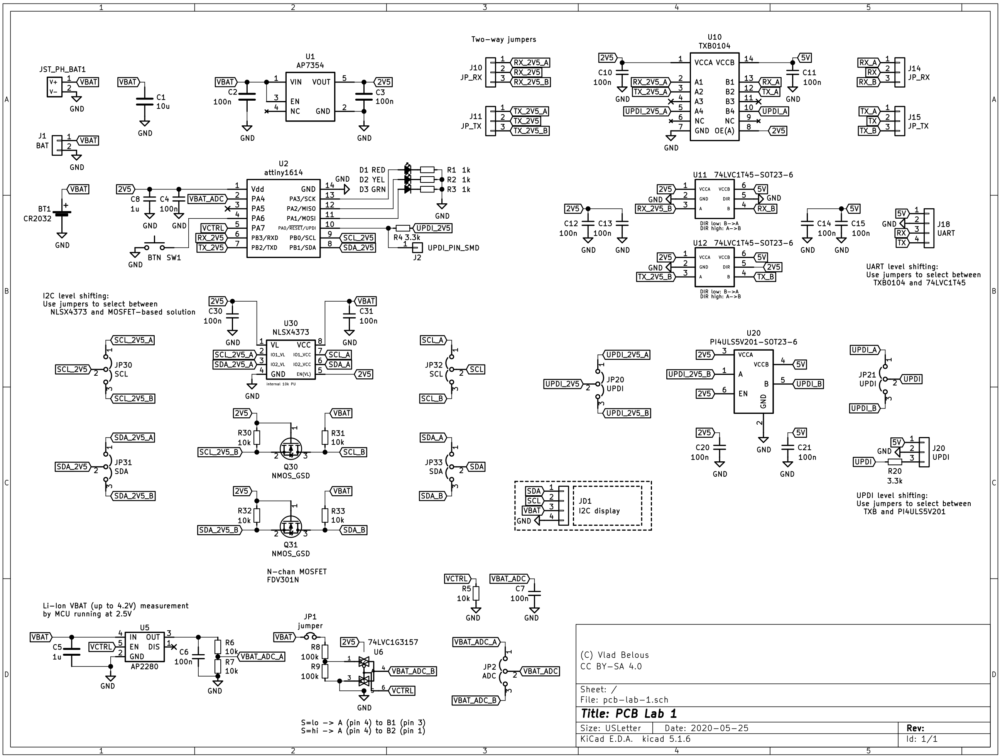

## PCB Lab #1 - Level Shifting

"Lab"-style PCB for experimenting with different voltage level shifting
solutions, as well as battery voltage measurement and reporting in a multi-voltage system.

TODO: add more description

## Schematic:

